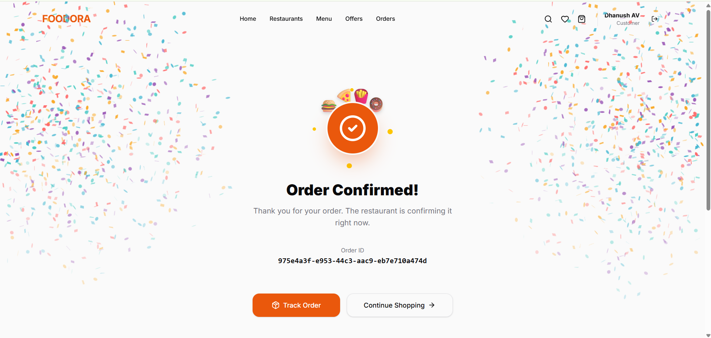

# Food Delivery System



A production-ready full-stack food delivery platform built with modern web technologies. This application provides a seamless, dynamic user experience for discovering restaurants, browsing menus, managing a cart, and processing checkouts.

## Live Demo

**Frontend:** [https://food-delivery-system-blush.vercel.app/](https://food-delivery-system-blush.vercel.app/)  
**Backend:** [https://food-delivery-system-m9nm.onrender.com](https://food-delivery-system-m9nm.onrender.com)

## Overview

The Food Delivery System is designed to connect hungry customers with local restaurants. 
- **Customers** can browse dynamic categories, search for specific cuisines, manage a persistent shopping cart, save their favorite meals, and simulate a complete checkout flow resulting in real-time order tracking.
- **Administrators** (Backend capability) can manage restaurants, food items, promotions, and track order lifecycles.

## Features

### Customer
- **Authentication:** Secure JWT-based login and registration.
- **Restaurant & Food Discovery:** Browse curated restaurants and food categories.
- **Search & Filtering:** Dynamic search by name, category, price range, and rating.
- **Sorting & Pagination:** Efficient data loading and ordering.
- **Cart & Favorites:** Persistent state management for shopping carts and favorite items.
- **Checkout Flow:** Transactional checkout process with order total calculation.
- **Order Management:** View order history and real-time status transitions.

### Admin
- **Data Management:** Full CRUD capabilities for Restaurants, Categories, and Foods.
- **Order Processing:** Update order statuses (Pending -> Preparing -> Out for Delivery -> Delivered).

## Tech Stack

**Frontend:**
- Next.js (React Framework)
- TypeScript
- Tailwind CSS
- Framer Motion (Animations)
- Lucide React (Icons)

**Backend:**
- Node.js & Express
- TypeScript
- Prisma (ORM)
- PostgreSQL (Database)
- JWT (Authentication)
- bcrypt (Password Hashing)

**Infrastructure:**
- Vercel (Frontend Deployment)
- Render (Backend Deployment)
- Hosted PostgreSQL

## Architecture

**Flow:**
`User → Next.js Frontend → REST API → Express Backend → Prisma ORM → PostgreSQL`

**Authentication Flow:**
Login credentials are submitted to the Express backend, verified via bcrypt, and a JWT is issued. The Next.js frontend securely stores this JWT and passes it in the `Authorization: Bearer <token>` header for all subsequent protected API requests.

## Project Structure

```text
food-delivery-system/
├── backend/
│   ├── prisma/          # Database schema & migrations
│   └── src/
│       ├── controllers/ # Request handlers
│       ├── middleware/  # Auth & Error handling
│       ├── routes/      # API route definitions
│       └── utils/       # Helpers (JWT, formatting)
└── frontend/
    ├── app/             # Next.js App Router pages
    ├── components/      # Reusable React components
    ├── contexts/        # React Context (Auth, Cart, Favorites)
    ├── lib/             # API client and utilities
    └── types/           # TypeScript interfaces
```

## API Overview

The backend exposes a comprehensive REST API grouped as follows:
- `/api/auth` - Login, registration, and session restoration (Me).
- `/api/restaurants` - Restaurant discovery and details.
- `/api/categories` - Food categorization.
- `/api/foods` - Food discovery, search, and filtering.
- `/api/cart` - User-specific shopping cart management.
- `/api/favorites` - User-specific favorite items.
- `/api/orders` - Order creation and history.
- `/api/promotions` - Active discounts and offers.

## Database

The PostgreSQL database is managed by Prisma and includes the following core entities:
- **User:** Customers and Administrators.
- **Restaurant & Food:** Relational catalog data.
- **Order & OrderItem:** Transactional records with price snapshots to prevent historical data mutation.
- **Cart & CartItem:** Active shopping sessions.
- **Favorite:** User preferences.

## Authentication & Security

- **JWT Authentication:** Stateless, scalable session management.
- **Role-Based Authorization:** Strict separation between Customer and Admin routes.
- **Ownership Isolation:** Users can only access their own carts, favorites, and orders.
- **CORS & Helmet:** Strict origin whitelisting and essential security headers.

## Deployment

- **Frontend:** Hosted on Vercel (`NEXT_PUBLIC_API_URL` pointing to backend).
- **Backend:** Hosted on Render (`FRONTEND_URL` configured for CORS).
- **Database:** Hosted PostgreSQL.

*(Note: The Render free-tier backend may sleep after 15 minutes of inactivity. The frontend implements a smooth "waking up" UX to handle cold starts gracefully.)*

## Local Development

**1. Clone & Install**
```bash
# Frontend
cd frontend
npm install

# Backend
cd backend
npm install
```

**2. Environment Variables**
Copy `.env.example` to `.env` in both directories and fill in the placeholders.
```env
# Backend .env
DATABASE_URL="postgresql://..."
JWT_SECRET="your_super_secret"
JWT_EXPIRES_IN="7d"
FRONTEND_URL="http://localhost:3000"

# Frontend .env
NEXT_PUBLIC_API_URL="http://localhost:5000"
```

**3. Database Setup**
```bash
cd backend
npx prisma generate
npx prisma migrate dev
npx prisma db seed
```

**4. Run Development Servers**
```bash
# Frontend (http://localhost:3000)
npm run dev

# Backend (http://localhost:5000)
npm run dev
```
