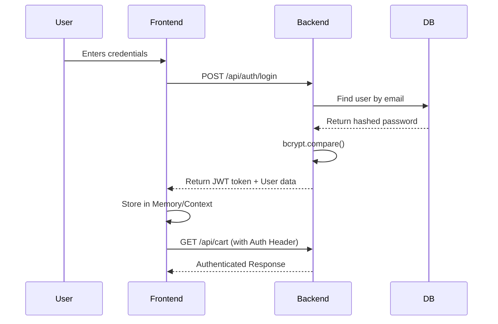
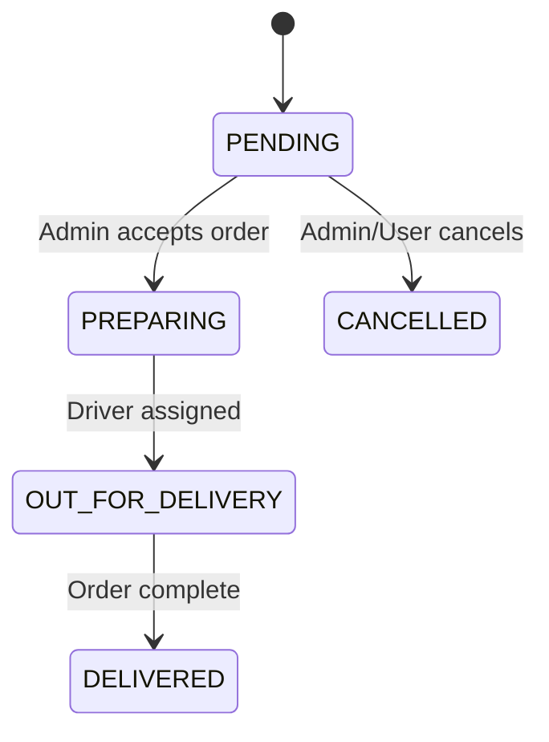

# Architecture

This document outlines the architecture of the Food Delivery System.

## System Overview

The application follows a modern decoupled architecture:
1. **Frontend:** A Next.js application handling the user interface, routing, and state.
2. **Backend:** An Express Node.js REST API handling business logic and security.
3. **Database:** A PostgreSQL database managed by Prisma ORM.

```mermaid
graph TD
    Client[Browser / Mobile] -->|HTTPS / REST| Frontend[Next.js Frontend\n(Vercel)]
    Frontend -->|HTTPS / REST| API[Express API Backend\n(Render)]
    API -->|Prisma Client| Database[(PostgreSQL\nDatabase)]
```

## Frontend Architecture

The frontend is built with Next.js App Router, emphasizing a mix of server and client components:
- **Server Components:** Used for SEO-friendly pages and initial data fetching.
- **Client Components:** Used for interactive UI elements (carts, favorites, checkout).
- **State Management:** React Context API (`AuthContext`, `CartContext`, `FavoritesContext`) is used for global state.
- **Styling:** Tailwind CSS combined with Framer Motion for smooth animations.

## Backend Architecture

The backend follows a standard Controller-Service-Route pattern:
- **Routes:** Map HTTP endpoints to specific controllers.
- **Controllers:** Handle request parsing, validation, and HTTP responses.
- **Services / ORM:** Business logic is executed via Prisma Client.
- **Middleware:** Global error handling, JWT authentication, and CORS enforcement.

## Authentication Flow

Authentication relies on stateless JWTs:



## Order Lifecycle

Orders transition through several states representing the physical fulfillment process.



## Checkout Flow

To ensure data integrity, checkout uses Prisma Transactions and Price Snapshots:

1. User requests checkout via `/api/orders`.
2. Backend verifies cart items and calculates total.
3. **Transaction starts:**
   - Create `Order` record.
   - For each cart item, create `OrderItem` with the *current* `priceAtTime` snapshot.
   - Clear the user's `Cart`.
4. **Transaction commits.**

This guarantees that if a restaurant changes a food's price tomorrow, historical orders maintain the correct totals.
