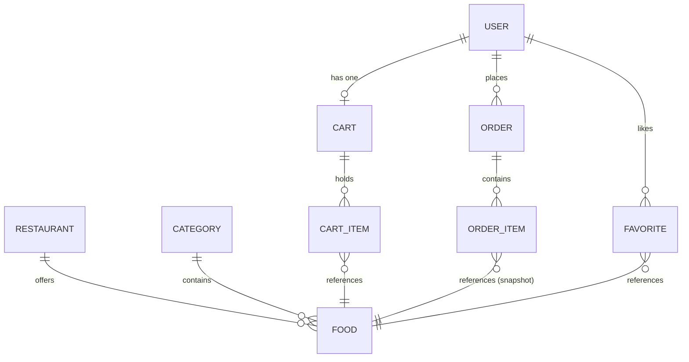

# Database Documentation

The system uses a highly relational PostgreSQL database managed through the Prisma ORM.

## Core Entities & Relationships

### `User`
- **Fields:** id, email, password, name, phone, role (enum), createdAt
- **Relationships:**
  - `1:1` with `Cart`
  - `1:N` with `Order`
  - `1:N` with `Favorite`
- **Indexes:** Unique index on `email`.

### `Restaurant`
- **Fields:** id, name, description, imageUrl, address, rating, isActive
- **Relationships:**
  - `1:N` with `Food`
- **Indexes:** Unique index on `name`.

### `Food`
- **Fields:** id, name, description, price (Decimal), imageUrl, isAvailable, restaurantId, categoryId
- **Relationships:**
  - Belongs to `Restaurant`
  - Belongs to `Category`
- **Design Note:** `price` is stored as `Decimal(10, 2)` to guarantee precision for monetary values.

### `Cart` & `CartItem`
- A single `Cart` is mapped uniquely to a `User`.
- A `Cart` contains multiple `CartItem`s.
- `CartItem` tracks the `quantity` of a specific `Food`.
- Carts are highly mutable and act as temporary holding areas.

### `Order` & `OrderItem`
- **Orders represent an immutable transaction.**
- When checkout occurs, cart items are mapped into `OrderItem`s.
- **Price Snapshots:** `OrderItem` copies the `price` of the `Food` into a `priceAtTime` column. This guarantees that future menu price changes do not retrospectively alter historical order receipts.

## ER Diagram (Mermaid)

## Money Handling
Prisma handles `Decimal` natively. When mapping to JSON for the Next.js frontend, Decimals are serialized to numbers. In JavaScript, all mathematical reductions for subtotals are processed, but the backend serves as the absolute source of truth during order creation.
